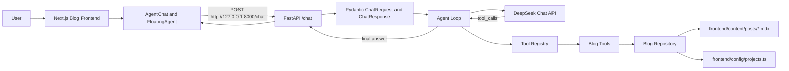

# Blog Agent

FastAPI backend for the JaoHun Blog AI assistant. The service exposes a small HTTP API, calls DeepSeek with tool calling enabled, and answers questions from real blog data stored in the companion Next.js blog repository.

## Status

- `GET /health` health check
- `POST /chat` chat endpoint
- DeepSeek chat completion client
- Tool-calling Agent loop
- Blog data repository for MDX posts and project config
- Four blog tools: `search_posts`, `get_post`, `get_projects`, `recommend_posts`
- Local CORS support for the Next.js frontend at `http://localhost:3000`

## Architecture



## API

### `GET /health`

Returns service status.

```json
{
  "status": "ok"
}
```

### `POST /chat`

Request:

```json
{
  "message": "你博客里有哪些项目？"
}
```

Response:

```json
{
  "reply": "博客里目前展示了 JaoHun Blog、Agent 与大模型学习记录、生活影像记录等项目。"
}
```

## Tools

| Tool | Purpose |
| --- | --- |
| `search_posts` | Search published blog posts by title, excerpt, category, and tags. |
| `get_post` | Read the full content of one published post by slug. |
| `get_projects` | Read the public project list from the blog frontend config. |
| `recommend_posts` | Rank and return related posts for a topic. |

## Local Setup

Install dependencies:

```powershell
python -m venv .venv
.\.venv\Scripts\Activate.ps1
pip install -r requirements.txt
```

Configure environment variables:

```powershell
$env:DEEPSEEK_API_KEY="<DeepSeek API key>"
$env:BLOG_ROOT="<path-to-blog-repository>"
```

`BLOG_ROOT` must point to the blog repository root. The backend reads:

```text
frontend/content/posts
frontend/config/projects.ts
```

Run the API:

```powershell
uvicorn app.main:app --reload --host 127.0.0.1 --port 8000
```

## Local Verification

Repository and tool checks:

```powershell
$env:BLOG_ROOT="<path-to-blog-repository>"
python -m scripts.check_blog_repository
python -m scripts.check_search_posts
python -m scripts.check_get_post
python -m scripts.check_get_projects
python -m scripts.check_recommend_posts
python -m scripts.check_tool_registry
python -m scripts.check_blog_repository_errors
python -m scripts.check_cors
```

Agent validation requires `DEEPSEEK_API_KEY`:

```powershell
$env:DEEPSEEK_API_KEY="<DeepSeek API key>"
python -m scripts.check_agent
```

Manual HTTP checks:

```powershell
Invoke-WebRequest -UseBasicParsing http://127.0.0.1:8000/health

Invoke-RestMethod `
  -Method Post `
  -Uri http://127.0.0.1:8000/chat `
  -ContentType "application/json" `
  -Body '{"message":"你博客里有哪些项目？"}'
```

## Repository Map

```text
app/main.py                         FastAPI app, CORS, HTTP routes
app/schemas/chat.py                 Chat request and response models
app/llm/deepseek_client.py          DeepSeek API client
app/agent/agent.py                  Agent loop and tool-call handling
app/agent/registry.py               Tool dispatch table
app/agent/tool_schemas.py           DeepSeek tool schemas
app/repositories/blog_repository.py Blog MDX and project config readers
app/tools/                         Blog data tools
scripts/                           Local verification scripts
```

## Companion Frontend

The companion frontend lives in the blog repository `frontend` directory and calls this service from:

- `/agent`
- `/en/agent`
- the global floating Agent window mounted in the Next.js root layout

The frontend defaults to `http://127.0.0.1:8000` and can override it with `NEXT_PUBLIC_AGENT_API_URL`.
